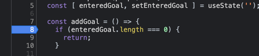
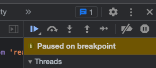
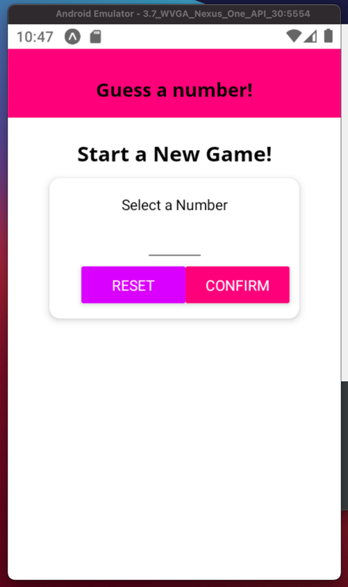
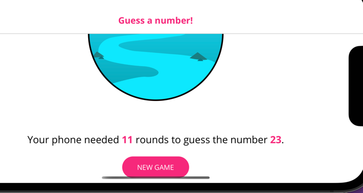
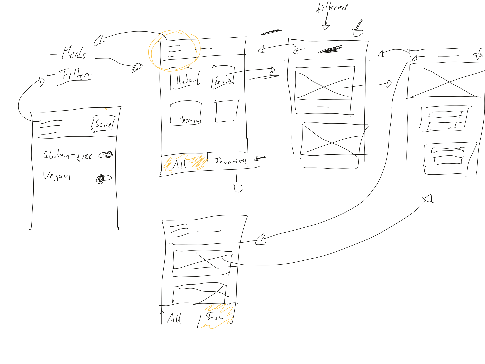
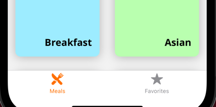

# 1. Getting Started [LEGACY]

## 1.1. Welcome!
___

## 1.2. What is React Native?
* It's a collection of "special" React (normal React) components.
* React Native then compiles theses cmps to the native widgets of iOS and Android.
* gives you the interfaces to use the mobile device components like camera.
___

## 1.3. Join our Online Learning Community
___

## 1.4. How React Native Works
### UI Cmps
React ``<div>`` = Native Cmp (Android) ``android.view`` = Native Cmp (iOS) ``UIView`` = React Native ``<View>``  
React Native is going to compile ``<View>`` to the ``UIView`` for iOS and to the ``android.view`` for the android!

### Logics
But the Logic in a React-Native app WON'T BE COMPILED to the native language (Java or Swift), instead of that React-Native itself works like a native app on the mobile device and RUNS __JavaScript thread hosted by the react native__.  

It's like that: if you want to access the camera, your JS code will run a such a "JS Core VM" which through a __Bridge__ communicate with the Native Platform Modules and APIs.
___

## 1.5. Expo CLI vs React Native CLI
To __create__ and __manage__ our React-Native app we have two approaches: Expo CLI or React-Native CLI

### Expo CLI
* 3rd party service
* free to use
* "Managed App Development" : it takes lot of complexities away for you!
* lots of convenience and utlitiy features
* Downside: You're __limited__ to the Expo ecosystem
* It also gives a wrapper mobile app for your application to simulate and test during development.
* (Mori: I think this is somewhoe like `create react app`)

### React-Native CLI
* offered by React Native Team
* bare-bon dev (only a basic setup)
* Downside: you are more on your own
* Advantate: full flexiblity: Integrity with any native code.

You can always switch (``eject``) from Expo to react native cli.  
We will use for the majority of the course Expo CLI! 
___

## 1.6. Node.js Download
___

## 1.7. Creating Our First React Native App
1. Go to ``expo.io``
2. Click on "Get Started"
3. Install Node.js
4. Install Expo: ``sudo npm install expo-cli --global``

### Create EXPO App:
1. ``cd to/folder/you/want``
2. ``expo init APP_NAME``
3. Choose "blank"
4. ``cd APP_NAME/``
5. ``npm start`` - Now you see Expo DevTool
6. Go to your Android/iOS device and in the app store search for "Expo"
7. Install it on your mobile device.
8. Open the application
9. then scan the QR-code which appeared on your computer after ``npm start`` - You have now the app on your mobile device (On iOS you should go to Camera App but on Android you can scan QR code directly from the Expo app)
___

## 1.8. Working on Our First App
Directories:
* .expo/ : some configs, you dont need to touch this.
* assets/ : hold media like images of your application

The Styling-Syntax of React-Native looks like CSS but it's not actually CSS!

* ``onPress`` : This is equivalent to ``onClick`` and Click event listener in JS.

TEST: Now on your mobile phone when you click on the "Change Text", the text changes! Magic!
___

## 1.9. React Native Apps Are Hard Work!
React Native is about : _"Learn once, write everywhere!"_  
and it's not Write Once!, because for different platforms you need to use if-statements sometimes in React-Native code, for example if it's an iOS ``do this`` but if it's an android phone ``do that``

In React-Native you are also responisble for the responsive design like in web applications and css!
___

## 1.10. React Native Alternatives
* React-Native changes VERY fast and the new versions of it come out like every month! So sometimes you need to adjust your react-native app.
___

## 1.11. Course Requirements
___

## 1.12. Course Requirement Refreshers
___

## 1.13. Running the App on an Android Emulator
We don't need to test the app on the real smartphone, we can use the simulartor.

### For iOS simulater you need: Xcode
https://docs.expo.dev/workflow/ios-simulator/

### For Android you need: __Android Studio__
https://docs.expo.dev/workflow/android-studio-emulator/

1. Download Android Studio
2. On MacOS make sure that you follow these steps:
   * If you are on macOS or Linux, add an environment variable pointing to the Android SDK location in ~/.bash_profile (or ~/.zshenv if you use Zsh) - eg. export ANDROID_SDK=/your/path/here. Copy and paste these two lines to do this automatically for Bash and Zsh:
   [ -d "$HOME/Library/Android/sdk" ] && ANDROID_SDK=$HOME/Library/Android/sdk || ANDROID_SDK=$HOME/Android/Sdk
   echo "export ANDROID_SDK=$ANDROID_SDK" >> ~/`[[ $SHELL == *"zsh" ]] && echo '.zshenv' || echo '.bash_profile'`
   
    * On macOS, you will also need to add platform-tools to your ~/.bash_profile (or ~/.zshenv if you use Zsh) - eg. export PATH=/your/path/here:$PATH. Copy and paste this line to do this automatically for Bash and Zsh:
   echo "export PATH=$HOME/Library/Android/sdk/platform-tools:\$PATH" >> ~/`[[ $SHELL == *"zsh" ]] && echo '.zshenv' || echo '.bash_profile'`
   
    * Make sure that you can run `adb` from your terminal.

2. Install it
3. Open the Android Studio
4. Click on "Configure" and choose "SDK Manager"
5. Install some of the older versions of the Android (for the course you need Android 9.0 (Pie) to be installed)
6. Go to "SDK Tools"
7. Install also "Android Emulator", "SDK-Platform-Tools" and "SDK Build-Tools" and also "Intel x86 Emulator Accelerator" and also "Google Play Services" in the list.
8. ~~Now go to start page again and then "Configure" > "AVD Manager"~~
   2022 => Click on "More Action" > "SDK Manager"
9. "Create Virtual Device"
10. Click on for example "Pixel 2"
10. Make sure that you have one of the latest SDKs installed
11. Add `Android 9.0 (Pie)` and one other latests version of Android
11. Now in the "SDK Tools" Tab (2nd tab) make sure that `Android Emulator` , `Android SDK Platform-Tools` (Mori: maybe this one's name is changed to this `Android SDK Command-line Tools`Android Build Tools` `Android SDK Tools` and `Intel x86 Emulator...` are all installed
11. If you get error on `Intel x86 HAXM`, try to install it directly from Intel repo: https://github.com/intel/haxm/releases
11. On the welcome page of Android Studio go again to "More Actions" and then "Virtual Device Manager"
12. Choose "Pixel 2" (for course) - (the devices with PlayStore are recommended)
12. After the installation click on Next and the "Finish"
13. Now launch the device by clicking on the Green Play-Button.
14. Turn the device on.
15. now go back to the `rn-first-app` project > `npm start`
16. localhost:19002 > "Run on Android device/emulator"
17. Instead of the above step you can press `a` in terminal (where the Expo is running) and then it launches the `rn-first-app` on the android-studio device.
___

## 1.14. Running the App on an iOS Simulator
!ONLY POSSIBLE ON MACOS!

1. Install Xcode
2. Go to Xcode "Prefernces"
3. Go to "Locations" tab and mace sure you have the Command Line Tools installed.
4. Go to Menu > "Xcode" > "Open Dev Tool" > "Simulator" > it opens an iOS device
5. go to Expo dev tool and click on "run ios simulator"
6. Now you see the app we created on the iOS Virtual Device!
___

## 1.15. Course Outline
___

## 1.16. How to get the Most out of This Course
___

## 1.17. Useful Resources & Links
Official Expo Docs: https://docs.expo.io/versions/v34.0.0/introduction/installation/

Official React Native Docs: https://facebook.github.io/react-native/docs/getting-started
___
___
___

# 2. Diving Into the Basics (COURSE GOALS APP) [LEGACY]

## 2.1. Module Introduction
___

## 2.2. How to work with React Native Components
___

## 2.3. Setting Up A New Project
1. ``expo init rn-complete-guide``
2. "blank"
3. ``yarn start``
4. press "i" to run on iOS simulator and "a" to run on Android Vritual Device (or use expo devtool)
___

## 2.4. Planning the App
We are going to create a "Goal app" where you can store the goals in a list and then by clicking on each item to delete the goal.

This app is to help to learn the core features of React Native.
___

## 2.5. Working with Core Components
* ``<View>`` is like ``<div>``.
* A text can be ONLY between ``<Text>`` tags!!! and not directly between `<view></view>` . It's different than HTML.
* ``flex`` sets how much can a child element take space of the parent relative to the other child elements.

To check all the React Native components: https://reactnative.dev/docs/components-and-apis
___

## 2.6. Getting Started with Styles
We can not see the `TextInput` when the app renders. That's because it's in the top of device display so we should add stylings to fix it.

Every component has its own allowed Style-properties , for example for `<view></view>` : https://reactnative.dev/docs/view-style-props

Style values should be in `Number` type and they will be interpreted with pixel unit, for example: `padding: 10` means like in css: `padding: '10px'`

Now if you click above "ADD" button. On android you see the soft keyboard opens but for iOS you should: go to Xcode top menu > "Hardware" > "Keyboard" > "Toggle Software Keyboard" (Mori: for newer version of Xcode: Xcode-Menu > "I/O" > "Keyboard" > "Toggle Software Keyboard")  
___

## 2.7. Flexbox & Layouts (Intro)
We want to bring the button next to the TextInput instead of being blow of it.

By default, the `<View>` has something like `display: flex;` of CSS.
___

## 2.8. React Native Flexbox Deep Dive
Mori: I DID NOT WATCH THIS LECTURE COMPLETELY, BECAUSE IT SHOULD WORK ALMOST LIKE CSS FLEXBOX...

* A ``<View>`` different to the ``<div>`` is already a flexbox and applies it to its children by default in column direction!
* We can change direction with ``flexDirection: 'row'``

* By default the ``alighItems: 'stretch'``, so the child elements take the height of the parent by default, we can change for example by setting it to ``'center'``

* ReactNative Flexbox cheatsheet: https://reactnative.dev/docs/flexbox
___

## 2.9. Inline Styles & StyleSheet Objects
* Why not outsourcing style objects without using StyleSheet.create() ??? because ``StyleSheet.create()`` : can detect syntax errors in styling and also potential performance improvments.
___

## 2.10. Working with State & Events
* ``onChangeText`` : like `onChange` in ReactJS

* `console.log()` : You see the logs on the terminal, where the Expo is running.  
  Alternatively you can see the logs in the browser localhost:19002 > "Click on the device" > log is there.


__TEST1__ : In Terminal you should see the text you entered in the input field.

__Goal__ : Add the entered goal to the list of goals!

ATTENTION -> ``prevGoals => ...`` 
___

## 2.11. Outputting a List of Items
___

## 2.12. Styling List Items

* ``Text`` cmp support less styling features than ``View`` cmp, so we rap Text cmp with a View cmp.

* ``marginVertical`` : it's like ``margin-top`` & ``margin-bottom`` in CSS together.

___

## 2.13. Making it Scrollable with ScrollView!

If in this small app which we made, you produce a lot of items for the list, it will goes out of the screen, and the SCROLLING IS NOT AUTOMATICALLY ACTIVE!!! So we should enable it with ``ScrollView`` cmp!

``ScrollView`` has a lot of attributes, you can check them in the official docs.

___

## 2.14. A Better List: FlatList

``ScrollView`` is great for a long list, but it's NOT suitable for a list which you DON'T KNOW how LONG it will be or which might be very very long. For shorter lists which exceeds screen ``ScrollView`` would be ok.

The problem of ``ScrollView`` is that it LOADS ALL the contents IN ADVANCE, even the ones which are not on the screen!!! It SLOWS DOWN YOUR APP!

The solution is ``FlatList`` cmp it has two important attributes: 
* ``data`` (should point to an ARRAY)
* ``renderItem``

* elements in the ARRAY should be objects which have a ``key`` prop (NEW: or `id`). (``key`` should be string)
* In `<FlatList>` you can use `keyExtractor` (which by default has this function as value: `(item, index) => item.key`) to customize the above prop.  

* If you enter sth except "key" or "id" as key you should specify it using ``keyExtractor`` as attr of the ``FlatList`` cmp.

* FlatList cmp ONLY renders what's REQUIRED.
___

## 2.15. Splitting the App Into Components (Own Components)
___

## 2.16. Passing Data Between Components

Mori: I have done it in the __2.15__ myself.
* This is __HOW TO PASS DATA TO A FUNCTION AS PARAMETER AND SEND IT TO THE PARENT CMP__!!! ``GoalInput.js``

___

## 2.17. Working with Touchable Components

__Our Goal:__ Delete the items by tapping the item using Touchable Component Family!

* ``TouchableOpacity`` gives user feedback by making the UI element transpaernt when he touches it. We can configure the opacity's change with ``activeOpacity``

* ``TouchableHighlight`` ... (props: underlayColor, ...)

* ``TouchableNativeFeedback`` only works on Android devices.

* ``TouchableWithoutFeedback`` : as the name suggests, it has no visual effects when touching.

when you go to TouchableOpacity page, REACT NATIVE SUGGESTS:

_If you're looking for a more extensive and future-proof way to handle touch-based input, check out the Pressable API._

https://reactnative.dev/docs/pressable
___

## 2.18. Deleting Items
___

## 2.19. Adding a Modal Overlay
https://reactnative.dev/docs/modal

We want to move GoalInput view to a Modal.

* ``<Modal>`` cmp - (__Our Goal:__ We want to show the GoalInput cmp in a modal!)

___

## 2.20. More Flexbox Styling
Now we should fix styling of modal (`GoalInput.js`)

* ``View`` cmp takes the height of its children, so without children it has height and width are 0.

* `flex` (in inputContainer) : `flex` allows you to control how much space your different items inside of a flexbox take.  
  
When you have only one item like our case now, you only need to set a value for `flex` (value can be 1,2,3,... if there is only one single item there it does not matter). It ensures that this single item inside of `View` takes the full space.

___

## 2.21. Closing the Modal & Clearing Input
___

## 2.22. Finishing the Modal Styling
IMPORTANT: to giving style to `<Button />`s you MUST wrap it in a `<View>` as you see in this lecture!
___

## 2.23. Wrap Up
___

## 2.24. Useful Resources & Links

These links might also be helpful:

* Official Docs: https://facebook.github.io/react-native/docs/getting-started

* Overview of available Components & APIs: https://facebook.github.io/react-native/docs/components-and-apis

Expo Docs: https://docs.expo.io/versions/latest/

___

___
___
___

# 3. Debugging React-Native Apps [LEGACY]

## 3.1. Module Introduction
___

## 3.2. What To Debug & How To Debug?

What to debug?
* __Error Messages / App Crashes__, like:
    * Syntax errors.
    * bugs (e.g. ``undefined``, usw)
    * "Unavoidable" errors: (network errors, request and resp errors)

* __Logical errors__
    * undesired or unexpetcted app behaviour
    * unexpected / unhandled user behaviour
    * sequence of steps leads to errors

* __Wrong styling and layout__
    * different devices
    * very small devices

How to debug?
* READ the error messages carefully!
* using ``console.log()``
* Chrome Debugger + Breakpoints
* Mori: Webstorm Debugger 
___

## 3.3. Running the App on a Real Device & Debugging

Don't forget, with Expo, you can easily run your app on real devices, too!

Simply download the Expo app from the App Stores and scan the barcode the Expo DevTools (that browser tab which opened when you ran ``npm start``) show.

On iOS devices, you don't scan the barcode with the Expo app but instead with your normal device camera (simply point it at the barcode and you should be prompted whether you want to open that app in the Expo app).

On Android devices, you find an integrated barcode scanner in the Expo app.

---

With the app running on a real device, you can debug it from there, too. Shake the device a little to bring up the developer menu.

There, you can enable the remote debugger and the other features covered in this module.

___

## 3.4. Handling Error Messages

_Mori: I did not code with! - Check the video._

___ 

## 3.5. Understanding Code Flow with console.log()

_Mori: I did not code with! - Check the video._

___

## 3.6. Using the Remote Debugger & Breakpoints

1. Debugging with Expo:
    * on iOS device + Mac: ``CMD+D``
    * on Android device + Mac/Windows: ``CMD/CTRL+M``

2. In the menu choose "Debug Remote JS" (The Connection in Expo DevTool should be set to "LAN" or "Local") 

3. Chrome DevTool > "Source" tab

4. In left menu of "Source" tab , go to a file which beginns with `debuggerWorker... .js` > open `Users/morteza/Desktop/...`

5. Now here you can see the folder structure in `src` (in uncompiled/not-built version of your code!!!)

6. For example there set a breakpoint on Line 8 `GoalInput.js > addGoal() > if (enteredGoal.lenght === 0)`
    

7. Now in the app, add a new goal and press "ADD"

8. In DevTool now you see that the this line is highlighted and it pauses the app.

9. You can now bring the app to next step or backward, etc using control buttons in DevTool:
    
   
__For more information on chrome's debugging tool__: https://developers.google.com/web/tools/chrome-devtools/
___

## 3.7. Working with the Device DevTools Overlay

Debugging with Expo:
* on iOS device + Mac: ``CMD+D``
* on Android device + Mac/Windows: ``CMD/CTRL+M``

* Other Features:
    * Reloading App, you can also do that using:
        * Android, also with hotkey ``RR``
        * iOS:, also with hotkey ``CMD+R / CTRL+R``
    
    * Enable Hot Reloading

    * Show Performance Monitor
        * Shows how your app uses the smartphone resources
        * ATTENTION: As we are in develop mode, the performance is worse than in production mode.

___

## 3.8. Debugging the UI & Using React Native Debugger

* __Inspector:__ In Menu of Expo App on Mobile Device (`Show Element Inspector`)
* You can check the components

There is a better tool: __React-Native Debugger__

1. Search for "React-Native Debugger"
2. Go to https://github.com/jhen0409/react-native-debugger
3. Go to Release Page of it : https://github.com/jhen0409/react-native-debugger/releases
4. Download the compatible one for your Desktop OS and install it.
4. Open the installed app
5. On the virtual mobile device choose `JS Remote Debugger`
6. Back to debugger app, use these keys: ``CMD+T`` (=> iOS or cmd+m for android)
7. Enable "Remote JS Debug" on the virtual mobile device.

You see all the components structure. This is MUCH NICER than other Debugger which we learned! It has also Redux debugging tool for the React-Native.

You can also change the Styling with this Debugger, just like on normal chrome dev tool!!!

You can use ``Profiler`` you can optimize RERENDERINGs in you app, for example to detect the UNNECESSARY RERENDERINGS in your App, just like in normal React Debugger

___

## 3.9. Wrap Up
___

## 3.10. Useful Resources & Links

* Expo Debugging Docs: https://docs.expo.io/versions/v34.0.0/woflow/debugging/

* Chrome Dev Tools Docs: https://developers.google.com/web/tools/chrome-devtools/

___

___
___
___

# 4. Components, Styling, Layouts - Building Real Apps [GUESS A NUMBER APP] [LEGACY]

## 4.1. Module Introduction
___

## 4.2. Setup & App Planning

* You set the number which computer should guess.
* after computered guessed a number:
    * if it is not the correct number, you give computer a hint "greater" or "lower"
    * If you give computer a WRONG hint
    * if it's the correct number, computer has won!
        * the message would be: "The AI found your number in X guesses"
        * and under the msg , a btn with "RESET" to reset the game.

___

## 4.3. Adding a Custom Header Component

* Remember: ``View`` cmp is already a Flexbox by default for styling

___

## 4.4. Adding a Screen Component
___

## 4.5. Working on the Layout
___

## 4.6. Styling a View as a "Card" Container (with Drop Shadows & Rounded Corners)

* All the Shadow properties, like ``shadowColor``, ``shadowOffset``, ... ONLY WORK ON __iOS__.

* For that you can use ``elevation`` for the Android, which would NOT work on iOS.

___

## 4.7. React Native Styling vs CSS Styling

Styling in React Native is inspired by CSS - but it's not equivalent!

You must never forget that React Native in the end is all about translating React components (like <View> or <Text>) to native widgets (like UIView or widget.view - see section 1 of the course, I do dive into this there)!

These native widgets don't understand CSS. They have nothing to do with the web, HTML or anything like that!

What the React Native team does, is the following: They also provide "style translations" => CSS-inspired styling commands/ properties which also are translated to styling configurations those native widgets understand.

Hence backgroundColor: 'black' works - it simply targets the platform-specific configurations for the native widget that will result in a black background to be drawn. Even if these native instructions look nothing like CSS. React Native does the heavy lifting behind the scenes.

That's why many but absolutely not all CSS properties are supported in React Native. That's also why styling is done via JavaScript and not CSS. In addition, not all React Native components support all style properties.

<Text> doesn't support flexbox-related properties for example - but I'll dive into this later in the course.

___

## 4.8. Extracting a Card Component (Presentational Component)

___

## 4.9. Color Theming with Constants
___

## 4.10. Configuring & Styling a TextInput
In `AppInput.js` because we define the 

```
style={{
    ...styles.appInput,
    ...props.style
}}
```

after 

```
{ ...props }
```

so `style` will override the `props.style` otherwise the `styles.appInput` would have no effect!
___

* `keyboardType = 'number-pad'` : When mobile softkeyboard opens, it presents the NumPad. (ONLY for complete Numbers (integers) on iOS. For Android we need another approach to prevent user to enter a floating number)
___

## 4.11. Cleaning User Input & Controlling the Soft Keyboard (Input Validation)
- With adding this regex in AppInput.js now it's impossible to add a comma from Android numpad

- iOS Problem: The Keyboard does not want to close (When we tap outside of it or try to close it)! For this problem we use `<TouchableWithoutFeedback>` and `Keyboard` API from react-native (`StartGame.js`)
___

## 4.12. Resetting & Confirming User Input
___

## 4.13. Showing an Alert
___

## 4.14. Time to Finish the "Confirmation Box"
___

## 4.15. Adding Random Number Generation
___

## 4.16. Switching Between Multiple "Screens"
___

## 4.17. Adding Game Features: Hints & Validation
Another usecase of `useRef()` is like a state manager, because it can survive the component rerendering and keep the data!

Mori: also in this use case `useRef()` works somehow like `computed` in Vue. Because when it gets updated, it does not cause a component rerendering. But `useState()`s cause rerendering when they get updated!

ERROR: `useEffect()` die eine Abhaengigkeit von einem useState() hat, muss nach diesem useState() abgerufen werden!!!!!
___

## 4.18. Checking the "Win" Condition with useEffect()
___

## 4.19. Finishing the Game Logic
___

## 4.20. Adding AppLoading
In the next lecture, we'll add the AppLoading component.

We will do this by importing it like this:

`import { AppLoading } from 'expo';`
This might fail for you - depending on the version of Expo you're using to follow along.

If it does fail, try this alternative way of adding it:

`expo install expo-app-loading`
`import AppLoading from 'expo-app-loading';`
___

## 4.21. Adding Custom Fonts
1. run `expo install expo-font`
2. For `AppLoading` : ``expo install expo-app-loading``

Test: the "Start a New Game!" should have now the new Font!
___

## 4.22. Installing expo-font
Depending on the version of Expo you're using, you very likely need to install the expo-font package.

You can do this in two different ways and it's important to understand the difference:

1) npm install --save expo-font

2) expo install expo-font

2) is recommended - but what is the difference?

npm install installs a packages a dependency into the project - we use this command for most packages which we do install.

Some packages (typically all expo-* packages) can break the app if you install the wrong version though - because they closely work together with Expo itself.

To get the right package version for the specific version of Expo your app relies on, expo install is the right "tool". It also just executes npm install behind the scenes but it picks a specific (i.e. the correct) version of the package to be installed.

Hence for all expo-* packages, npm install can be used but expo install is the preferred command to avoid errors. Of course you could always try npm install first and only run expo install if you thereafter do face any errors.
___

## 4.23. A Synthetic Style "Cascade": Custom Wrapper Components & Global Styles
You can't add the `fontFamily` on styling of `<View>` !!! You should add it directly to the styling `<Text>`

You have 2 options to make a styling global:

1. Create your own cmp for example like `components/BodyText.js` and use it everywhere.

2. Exporting a global style object like: `default-styles.js`
___

## 4.24. Adding Local Images
Using `<Image />` you can use local and network images.
___

## 4.25. Styling Images
On Image-cmp `resizeMode` is helpful to correct aspect ratio of the image

it has values: 'contain' , 'cover' (default) , ...
___

## 4.26. Working with Network (Web) Images
For a network image you should set the value of `source` prop in Image-cmp to an object!

For images from network having `width` and `height` on Image-cmp is a must!

with `fadeDuration` you can set the fade-in time in milliseconds.
___

## 4.27. A Closer Look at the "Text" Component (and what you can do with it)
* Note: You can have Text-cmp inside another Text-cmp.
* Style of <Text> cmp will be inherited by its <Text> child. This is an exception! Otherwise as we said in this course, the Styling of a a React-Native element will not be inherited by its children elments.
* By default the <Text> wraps its text into the next line if it has no more space in display of the device. But if you don't want that the <Text> wraps, you can set the `numberOfLins` prop, maybe combined with `ellipsizeMode` to truncate instead of wrapping line.
___

## 4.28. <View> vs <Text> - A Summary
<Text> and <View> are probably THE most important/ most-used components built into React Native.  

<View> is your #1 component if you need to group and structure content (= provide a layout) and/ or if you want to style something as a container (e.g. the <Card> look we built in our custom <Card> component).

<View> uses Flexbox to organize its children - have a look at the Flexbox deep dive earlier in this course (in module 2) to learn more about how that works.

A <View> can hold as many child components as you need and it also works with any kind of child component - it can hold <Text> components, other <View>s (for nested containers/ layouts), <Image>s, custom components etc.

If you need scrolling, you should consider using a <ScrollView> - you could wrap your <View> with it or replace your <View> (that depends on your layout and styling). Please note, that due to its scrollable nature, Flexbox works a bit differently on a <ScrollView>: https://stackoverflow.com/questions/46805135/scrollview-with-flex-1-makes-it-un-scrollable

---

<Text> is also super important. As its name suggests, you use it for outputting text (of any length). You can also nest other <Text> components into a <Text>. Actually, you can also have nested <View>s inside of a <Text> but that comes with certain caveats you should watch out for: https://github.com/facebook/react-native/commit/a2a03bc68ba062a96a6971d3791d291f49794dfd

Unlike <View>, <Text> does NOT use Flexbox for organizing its content (i.e. the text or nested components). Instead, text inside of <Text> automatically fills a line as you would expect it and wraps into a new line if the text is too long for the available <Text> width.

You can avoid wrapping by setting the numberOfLines prop, possibly combined with ellipsizeMode.

Example:

<Text numberOfLines={1} ellipsizeMode="tail">
  This text will never wrap into a new line, instead it will be cut off like this if it is too lon...
</Text>
Also important: When adding styles to a <Text> (no matter if that happens via inline styles or a StyleSheet object), the styles will actually be shared with any nested <Text> components.

This differs from the behavior of <View> (or actually any other component - <Text> is the exception): There, any styles are only applied to the component to which you add them. Styles are never shared with any child component!
___

## 4.29. Building a Custom Button Component
We want to have a unified button for both Android and iOS
___

## 4.29. Adding Icons
package: `@expo/vector-icons`

More about Expo Icons: https://docs.expo.dev/guides/icons/
___

## 4.30. Exploring UI Libraries
There are a lot of UI Libraries for React Native to make the life easier.

Here are a list of some of them: https://docs.expo.dev/guides/userinterface/
___

## 4.31. Managing Past Guesses as a List
___

## 4.32. Styling List Items & Lists
* IMPORTANT: FlatList component should be styles with the prop `contentContainerStyle`. You can NOT use `style` prop on FlatList to style the whole list.
___

## 4.33. ScrollView & Flexbox (Yes, that works!)
Just like for `<FlatList>` you should also use `contentContainerStyle` to style the `<ScrollView>`.

`flexGrow` : read it in the official docs!
___

## 4.34. Using FlatList Instead of ScrollView
___

## 4.35. Wrap Up
___

## 4.36. Useful Resources & Links
___

___
___
___

# 5. Responsive & Adaptive User Interfaces and Apps [LEGACY]

## 5.1. Module Introduction
Your App should looks like good on both iOS and Android and also on different size of devices.

You also should make your App responsive when the device rotates! Responsivness for both landscape and protrait modes.

We will work on the App from the previous chapter.
___

## 5.2. Finding Improvement Opportunities
Let's assume the market we are targeting may use very small devices:

1. Go to Android Studio
2. "More Actions" > "Virtual Device Manager" > "Create device"
3. Choose for example "3.7inch WVGA Nexus"
4. Download the Android OS > and boot the device

Now you should see the application looks like this:



which does not look that good. And also the app does not scroll!

And also on the Game-Over screen, you don't see the Restart button anymore!
___

## 5.3. Working with More Flexible Styling Rules
empty
___

## 5.4. Introducing the Dimensions API
`Dimension` is an object, which gives you information about width/length and available pixels of the device.

`Dimensions.get('window').width` : This is the width of the device.

for the width of button you could have use precentage, but Max wanted here to show the `Dimensions` API.
___

## 5.5. Using Dimensions in "if" Checks
We want to reduce the gap between the number and the box of the plus/minus buttons and also we want to make sure that the round boxes are down there.
___

## 5.6. Calculating Sizes Dynamically
The GameOver Screen is also defect.
___

## 5.7. Problems with Different Device Orientations
Let's rotate the devices!  
* iOS: In the top-bar menu > "Device" > "Rotate Left"
* Android: the rotate-left icon

But now you see that your app is still portrait! The reason is that the by default Expo locks the app in `app.json > "orientation": "portrait",`

For some apps it is useful, because for some apps it does not make sense to have landscape mode. In contrary some apps (like some game apps) needs only to be in landscape mode so: `"orientation": "portrait"`

`"orientation": "default"` : This rotates the app when the device rotates.

If you change it in the `app.json` you need to restart the expo and app on your end devices.


ERROR: On the "3.7inch WVGA Nexus One" if the app does not rotate.

Now we want to make our responsive to the DEVICE ROTATION in the next lecture!
___

## 5.8. Controlling Orientation & Using the KeyboardAvoidingView
One Solution is to make StartGame scrollable so it works also in landscape mode.

On the `STartGame` we have two other problems: 1. Layout does not look good 2. Keyboard is too big in landscape mode!

`KeyboardAvoidingView` is a React-Native component to wrap your component inside a <ScrollView>  to make sure that your Soft-Keyboard NEVER cover the input field, in which you are typing with the soft-keyboard!

Props:
* `keyboardVerticalOffset` : which sets the ammount of input-field sliding up
* `position` : `padding` | `position`


Notation: On __Android__ you can use `disableFullscreenUI={true}` on the `TextInput` component to avoid the keyboard cover the whole screen when you focus on the input field. Otherwise, keyboard covering the whole screen is the default behaviour by android.
___

## 5.9. Listening to Orientation Changes
Now if we go back to Portrait mode we see that style is defect!

The Problem is that in `StratGameScreen.js` where we seet the `styles.button` , we use `Dimension.get('window')`. And createStyles only gets calculated when the App starts!

`Dimensions.addEventListener('change')` this gets triggered when user rotates the device.
___

## 5.10. Rendering Different Layouts
We we run the game the `Game.js` screen does not look good in Landscape mode. One solution is to change the styling a little bit, because of the height of `Game.js`. ALTERNATIVELY we can render another layout base on the available width/height

We can for example render the buttons to the left and right of the NumberContainer when the app is in landscape mode.
___

## 5.11. Fixing the GameOver Screen
empty
___

## 5.12. Updating All Code to Update Dynamically
In the video lectures, I didn't change all the code to take advantage of `addEventListener` on `Dimensions` (simply to avoid unnecessary repetition).

In case you're interested, here's how you would change the code to always update your styles when the `Dimensions` change.


`StartGameScreen.js`  

No changes required, all styles do update when `Dimensions` change.


`GameScreen.js`  

The `buttonContainer` style uses `Dimensions...height` to change `marginTop`.

```js
buttonContainer: {
    flexDirection: 'row',
    justifyContent: 'space-around',
    marginTop: Dimensions.get('window').height > 600 ? 20 : 5,
    width: 400,
    maxWidth: '90%'
},
```

Change this to:

```js
buttonContainer: {
    flexDirection: 'row',
    justifyContent: 'space-around',
    width: 400,
    maxWidth: '90%'
},
```

and in your component function, use inline styles to update `marginTop` on the `<Card>` where you use `styles.buttonContainer`:

```jsx
    <Card style={[...styles.buttonContainer, {marginTop: availableHeight > 600 ? 20 : 5}]}>
    ...
    </Card>
```

`availableHeight` is already some state we're managing, so you don't need to add this.

Side-note, totally unrelated to the Dimensions-listener thing: You could generally shorten the component code a little bit by only changing the NumberContainer + Button-Container part of your JSX code.

Like this:

```jsx
    let gameControls = (
        <React.Fragment>
        <NumberContainer>{currentGuess}</NumberContainer>
        <Card style={styles.buttonContainer}>
        <MainButton onPress={nextGuessHandler.bind(this, 'lower')}>
        <Ionicons name="md-remove" size={24} color="white" />
        </MainButton>
        <MainButton onPress={nextGuessHandler.bind(this, 'greater')}>
        <Ionicons name="md-add" size={24} color="white" />
        </MainButton>
        </Card>
        </React.Fragment>
    );

    if (availableDeviceHeight < 500) {
        gameControls =  (
            <View style={styles.controls}>
                <MainButton onPress={nextGuessHandler.bind(this, 'lower')}>
                    <Ionicons name="md-remove" size={24} color="white" />
                </MainButton>
                <NumberContainer>{currentGuess}</NumberContainer>
                <MainButton onPress={nextGuessHandler.bind(this, 'greater')}>
                    <Ionicons name="md-add" size={24} color="white" />
                </MainButton>
            </View>
        );
    }

    return (
        <View style={styles.screen}>
            <Text style={DefaultStyles.title}>Opponent's Guess</Text>
            {gameControls}
            <View style={listContainerStyle}>
                {/* <ScrollView contentContainerStyle={styles.list}>
                {pastGuesses.map((guess, index) => renderListItem(guess, pastGuesses.length - index))}
                </ScrollView> */}
                <FlatList
                    keyExtractor={item => item}
                    data={pastGuesses}
                    renderItem={renderListItem.bind(this, pastGuesses.length)}
                    contentContainerStyle={styles.list}
                />
            </View>
        </View>
    );
```
  
This introduces a new `gameControls` variable that manages the part of the JSX code that does actually change. Using this code instead of the one shown in the video lectures is totally optional though!


`GameOverScreen.js`  

This file doesn't use any listener, hence you need to add `useState` and `useEffect`.

```jsx
import React, { useState, useEffect } from 'react;
... // other imports

const GameOverScreen = props => {
const [availableDeviceWidth, setAvailableDeviceWidth] = useState(Dimensions.get('window').width);
const [availableDeviceHeight, setAvailableDeviceHeight] = useState(Dimensions.get('window').height);

    useEffect(() => {
        const updateLayout = () => {
            setAvailableDeviceWidth(Dimensions.get('window').width);
            setAvailableDeviceHeight(Dimensions.get('window').height);
    };
 
    Dimensions.addEventListener('change', updateLayout);
 
    return () => {
            Dimensions.removeEventListener('change', updateLayout);
        };
    });
 
    return (
        <ScrollView>
            <View style={styles.screen}>
                <TitleText>The Game is Over!</TitleText>
                <View style={‌{...styles.imageContainer, ...{
                    width: availableDeviceWidth * 0.7,
                    height: availableDeviceWidth * 0.7,
                    borderRadius: (availableDeviceWidth * 0.7) / 2,
                    marginVertical: availableDeviceHeight / 30
                }}}>
                    <Image
                        source={require('../assets/success.png')}
                        style={styles.image}
                        resizeMode="cover"
                    />
                </View>
                <View style={‌{...styles.resultContainer, 
                        ...{marginVertical: availableDeviceHeight / 60}}}>
                    <BodyText style={‌{...styles.resultText, ...{
                            fontSize: availableDeviceHeight < 400 ? 16 : 20}}}>
                        Your phone needed{' '}
                        <Text style={styles.highlight}>{props.roundsNumber}</Text> rounds to
                            guess the number{' '}
                        <Text style={styles.highlight}>{props.userNumber}</Text>.
                    </BodyText>
                </View>
                <MainButton onPress={props.onRestart}>NEW GAME</MainButton>
            </View>
        </ScrollView>
    );
};
// ...
```

Also remove the styles you're now setting as inline styles from the StyleSheet at the bottom of the file.
___

## 5.13. Expo's ScreenOrientation API
`Dimensions` API is the official api to use in React-Native. However, Expo also has a similar API `ScreenOrientation`:

`expo install expo-screen-orientation`

It has couple of featuers:

* `ScreenOrientation.lockAsync(ScreenOrientation.OrientationLock.PORTRAIT OR LANDSCAPE)` : This locks the orientation in one of both modes.

* `ScreenOrientation.getOrientatinAsync()` : Gets the orientation

* `ScreenOrienation.addOrientationChangeListener` : similar to `Dimenstions.addEventlistener('change', Fn)` . But it tells you directly if the phone device is in Landscape or Portrait mode

___

## 5.14. Introducing the Platform API
Now we want to recognize the end user device if it's an Android or iOS.

For example on iOS the buttons "Reset" and "Confirm" look differently than the buttons on Android. It's because that the `Button` cmp from React-Native is almose the ONLY component which adjust itself to the Platform (iOS or Android) it runs on it.

Goal: We want to have different looks for our `Header` cmp on Android and iOS.

__To recognize the client device React-Native has the `Platform` API.__

* `Platform.OS` has one of the values: `"ios"` , `"android"` , `"windows"` , `"macos"` , `"web"` 
___

## 5.15. Working with Platform.select() and Platform in "if" Checks
`Platform.select({ ios: any , android: any })` does the if-check for us!

`TouchableNativeFeedback` : it has a built-in object which gives us the riple-effect on android

__ONLY Capital Variables CAN be used as JSX elements!!__

Test: Now on Android you see that you have the riple-effect on the button!!! And on the other hand in the iOS you see that we have the opacity-effect!

And we also add the `View` to the `AppButton` cmp to correct the ripple-effect on the Android to only fills out the button and not around it!
___

## 5.16. Using Platform-specific Code Files
You can also use the prefix `.android` and `.ios` on your files, and then React-Native uses the one which is passing for the current platform!!

For example if you have `MyCmp.android.js` and `MyCmp.ios.js` then you should import it like this: `import MyCmp from 'path/to/MyCmp'` and then REactNative recognize those two files.

You can use the `.android` and `.ios` on any files in ReactNative.
___

## 5.17. Using the SafeAreaView
On the iPhone we have notch for frontcamera and Iris Sensor which takes part of the view. Also the Home-screen-Task-Manager Bar on the iPhone covers part of the dispaly and overlap our app. Also on android devices you could have notch or other covering parts on your app.  

For example on the `GameOver` Screen you can see that the Task-Manager Bar covers a part of the "NEW GAME" button:



For these cases ReactNative has a solution, the `SafeAreaView` component.

`SafeAreaView` should be used on the top most view! And it's the App.js

Now we have Spacings around the notch and the task-manager-bar.
___

## 5.18. Wrap Up
___

## 5.19. Useful Resources & Links
Attached, you find the code snapshots for this module (you also find those attached to multiple lectures in the module).

These resources might also be helpful:

* Dimensions API - Official Docs: https://facebook.github.io/react-native/docs/dimensions#docsNav

* Platform-specific Code - Official Docs: https://facebook.github.io/react-native/docs/platform-specific-code
___

___
___
___

# 6. Navigation with React Navigation [LEGACY]

## 6.1. Module Introduction
We want to build an app where we can navigate through pages.
___

## 6.2. Planning the App
Our build have following features:
* it can read recepies
* it can favorite recepies
* Setting filters
* ...


___

## 6.3. Adding Screens
___

## 6.4. Adding AppLoading
In the next lecture, we'll add the __AppLoading__ component.

We will do this by importing it like this:

`import { AppLoading } from 'expo';`  

This might fail for you - depending on the version of Expo you're using to follow along.

If it does fail, try this alternative way of adding it:

`expo install expo-app-loading`  
`import AppLoading from 'expo-app-loading';`

Also add the following prop to the `<AppLoading />` component (in your JSX code):

`onError={(err) => console.log(err)}`  

In the end, you should have:

```jsx
<AppLoading
startAsync={fetchFonts}
onFinish={() => setFontLoaded(true)}
onError={(err) => console.log(err)}
/>
```
___

## 6.5. Adding Fonts
if you don't have the `expo-font` you should install it: `expo install expo` (Mori: In my case it has been already installed with the project)

And then for `AppLoading` follow the steps in lecture __6.4.__ please.
___

## 6.6. React Navigation Docs
In case you want to dive into the official docs as well (we'll go through the installation in the next lectures, together), you can find the official docs here: https://reactnavigation.org/docs/4.x/getting-started
___

## 6.7. Installing React Navigation & Adding Navigation to the App
Mobile App Navigation compared to Web app navigations. What are the differences?  
In a web app the URL is the reference for the navigation so when you go to another page, the URL changes. For example in a ReactJS SPA, if you change the URL, there you have __React Router__ which then react to this change and renders different pages.  

But in the mobile app we don't have any URL! Instead you tap buttons and tabs.  
With the help of `react-navigation` which is built for ReactNative we can navigate around in a ReactNative app.

`npm install --save react-navigation`  

Mori: To be on the same boat with the course i install version 4: `npm install --save react-navigation@4`  

Then you should also the following packages too:

`expo install react-native-gesture-handler react-native-reanimated react-native-screens react-native-safe-area-context @react-native-community/masked-view`  


___

## 6.8. MUST READ: Installing Different Navigators
If you're using React Navigation v4 or higher, everything works as shown in this module but there is one important difference: You need to install the different navigators which we'll use in this module (StackNavigator, DrawerNavigator, TabsNavigator) separately.

So when we use the __StackNavigator__ (= next lecture), run:  

`npm install --save react-navigation-stack`  

before you start using it (with v3 and lower, it was part of react-navigation itself).

Also add this import in the file where you are using `createStackNavigator`:  

```js
import { createStackNavigator } from 'react-navigation-stack';
```  

Same for __TabsNavigator__ (used a little bit later in this module):  

`npm install --save react-navigation-tabs`   

```js
import { createBottomTabNavigator } from 'react-navigation-tabs';
```  

And also for __DrawerNavigator__ (also used later in this module):  

`npm install --save react-navigation-drawer`  

```js
import { createDrawerNavigator } from 'react-navigation-drawer';
```
___

## 6.9. Creating a StackNavigator
The simplest navigation which you find in any mobile app is going back and forth between the different pages of the app. The pages and screens of a mobile app are managed on a so called __Stack__.  
When the mobile app user goes to a new page, this page will be pushed on the top of that stack. So because of that it's called __StackNavigator__.
___

## 6.10. React Navigation & Code Attachments
You don't have to read this lecture - it's only relevant if you plan on running one of my code attachments!

Throughout the course, you find code attachments which you can use to compare your code to mine.

In case you want to run my attachments, make sure you follow these steps to use react-navigation v4 in them:

1) Run npm install and then expo upgrade

2) Install all extra navigators that are required for this specific code snapshot:

npm install --save react-navigation-stack

npm install --save react-navigation-tabs

npm install --save react-navigation-drawer

(of course you can combine that all into one npm install command if you need all of them)

3) Make sure you're using version 4 of react-navigation

npm install --save react-navigation@latest

4) Install all required dependencies

expo install react-native-gesture-handler react-native-reanimated react-native-screens react-native-safe-area-context @react-native-community/masked-view

5) Update all "navigator" imports

import { createStackNavigator, createAppContainer } from 'react-navigation';

would become

import { createAppContainer } from 'react-navigation';
import { createStackNavigator } from 'react-navigation-stack';
for example. Do that for all navigators (e.g. tabs, drawer) you might be using in the specific snapshot.

And with that, the attachments should work.

I basically show all of that throughout the lectures - I'm just summing it up here so that you have a quick & easy go-to reference.
___

## 6.11. Navigating Between Screens
___

## 6.12. Alternative Navigation Syntax
The "navigate to new screen" syntax shown in the previous lecture (and throughout this module) is pretty explicit/ clear, that's why I chose it for this introduction to React Navigation.

But instead of

props.navigation.navigate({routeName: 'SomeIdentifier'});
you can also use

props.navigation.navigate('SomeIdentifier');
This alternative is of course a bit shorter, other than that, it has no advantage or disadvantages compared to the more explicit one.

Throughout the course, I'll use both alternatives.
___

## 6.13. Navigation to the "Meal Details" Screen
___

## 6.14. Pushing, Popping & Replacing
* `navigation.push(NameOfMappedCmp)` : The difference with `.navigate()` is that with `.push()` you can go to page which you are already on that page! For example if you want to have a page using the same component but different contents, this feature of `.push()` could be useful. It's not possible with `.navigate()`.

* `navigation.goBack()` : Using it you can go to previous page programmatically. It pops off the screen we are on and brings us back.

* `navigation.pop()` : It's almost the same as `.goBack()` , but it ONLY works if you use the __StackNavigator__. The `goBack()` works on any type of Navigator.

* `navigation.popToTop()` : This function will pops off all the screen and brings you back to the route screen in the navigator!

* `navigation.replace()` : This will add the page to the stack but also removes the current page from the stack.
___

## 6.15. Outputting a Grid of Categories
Using `numColumns` on `<FlatList />` you can output a grid! The default value of it is `1`.

You don't need `keyExtractor` of <FlatList/> on the newer versions of ReactNative if your Item has an `id` but for reference we add it to our FlatList cmp.
___

## 6.16. Configuring the Header with Navigation Options
You can add the `.navigationOptions` to your CMP on fly and add title or other stuffs for the navigation! It has some useful props:

* `headerTitle` : to set the title of the screen.
* ...
___

## 6.17. Passing & Reading Params Upon Navigation
* `params` : to send data in the new screen using navigation
* `navigation.getParam(paramKey)`
___

## 6.18. Setting Dynamic Navigation Options
GOAL: We want to output the Category title in the header of our app.

We can achieve our GOAL here using `navigationOptions` just like in the `CategoriesScreen`, BUT the challenge here is that we set the navigationOptions after the component function has been renderes. So here we should use the __function form__ of the `navigationOptions`.

TEST: Now when we navigate into the category screens we see the title in the header.
___

## 6.19. Default Navigation Options & Config
We can outsource repeated parts of the `navigationOptions`.

Notice that if you have a same key in `defaultNavigationOptions` and `navigationOptions` it will be overwritten by the later one, which is plausible!  

__React Native Screens__ Package:  
* Installation: This package should be installed by expo out of the box but to ensure you can run `npm install --save react-native-screens`
* What it does is: It allows you to ensure that under the hood ReactNative uses the native optimized screen components provided by Android and iOS (in Android it is called the __Fragment__ and on iOS it is __UI View Controller__) and that improved the performance a bit more.
___

## 6.20. Grid Styling & Some Refactoring
___

## 6.21. Adding Meal Models & Data
___

## 6.22. Loading Meals for Categories
TEST: Now when we tap the categories we can see their meals!
___

## 6.23. Rendering a Meals List
using the `ImageBackground` component you can wrap it around the content you want to show in foreground and show the image behind it! So easy!
___

## 6.24. Passing Data to the Meal Detail Screen
tags: `navigate` , `params` , `navigationOptions`
___

## 6.25. Header Buttons: Using the Correct Version
In the next lecture, we'll add a package named `react-navigation-header-buttons`.

In order to avoid errors, make sure you're using the correct version of that package => Version 6

You can install that via `npm install --save react-navigation-header-buttons@6`

(instead of just npm install --save react-navigation-header-buttons which I use in the next lecture)
___

## 6.26. Adding Header Buttons
Tags: `navigationOptions` , `headerRight`

With `headerRight` you can render something in the right side of nvigation header.

But the problem is if you set the value of `headerRight` to a JSX directly (without using a package) it's very hard to get the right styling for different platforms. So we need to install the: `react-navigation-header-buttons` (in this course the version 6 of it: `npm install --save react-navigation-header-buttons@6`)


We also need the __VECTOR ICONS__ to have some icons:  `npm install --save @expo/vector-icons`
___

## 6.27. Fixing the Shadows
Problem: Shadow was gone on our Tiles.
___

## 6.28. Adding Tabs-based Navigation
We can tabs at the bottom of the screen which is typical for mobile apps.

For that from version 4 of react-navigation you should install `npm install --save react-navigation-tabs` 

You can have a whole stackNavigator as an Item in the __TabNavigator__!

You have always only __one__ root navigator in your app and you can have other navigators nested in that. So here we set our __TabNavigator__ as our Root Navigator instead of the stack navigator.

Tags: install , react-navigation-tabs , react-navigation > 4

ERROR after installation of the above package! Solution: `npm install --save react-native-reanimated@1.5` and then Reset Cache and Restart Expo: `expo r -c`


TEST: Now we have two tabs to switch!
___

## 6.29. Setting Icons and Configuring Tabs
___

## 6.30. navigationOptions inside of a Navigator
navigationOptions inside of a Navigator
When defining a navigator, you can also add `navigationOptions` to it:

```js
const SomeNavigator = createStackNavigator({
ScreenIdentifier: SomeScreen
}, {
navigationOptions: {
// You can set options here!
// Please note: This is NOT defaultNavigationOptions!
}
});
```  

Don't mistake this for the `defaultNavigationOptions` which you could also set there (i.e. in the second argument you pass to `createWhateverNavigator()`).

The `navigationOptions` you set on the navigator will **NOT be used in its screens**! That's the difference to `defaultNavigationOptions` - those option **WILL be merged with the screens**.

So what's the use of navigationOptions in that place then?

The options become important **once you use the navigator itself as a screen in some other navigator** - for example if you use some stack navigator (created via `createStackNavigator()`) in a tab navigator (e.g. created via `createBottomTabNavigator()`).

In such a case, the `navigationOptions` configure the "nested navigator" (which is used as a screen) for that "parent navigator". For example, you can use navigationOptions on the nested navigator that's used in a tab navigator to configure the tab icons.
___

## 6.31. Adding MaterialBottomTabs
Tags: Android Tabs

TheNow in Android the tabs are not typical for an Android Device but they look like iOS tabs:



It's actually not a big problem and you can use these tabs also on Android, but we could have a better match for android. First we should install a package:

`npm install --save react-navigation-material-bottom-tabs`

We also need another package:  

`npm install --save react-native-paper`
___

## 6.32. Adding a Favorites Stack

TEST: Now you see that we have two different StackNavigation for each one of these two tabs (Meals and Favorites).  
That means when we switch between these two tabs the page we were on it in each stack stay there when we come back on its tab!
___

## 6.33. Adding a Menu Button & Drawer Navigation
WARNING: For Drawer Navigation from `react-navigation v4` you should install the package: `react-navigation-drawer`
  
TEST: Now we have the Drawer navigation on our app screens

[//]: # (FIXME ON Android Device - Drower not closing when tapping outside of it!)
___

## 6.34. Configuring the Drawer
___

## 6.35. More Navigation Config & Styling
___

## 6.36. Adding a DefaultText Component
___

## 6.37. Adding the MealDetail Screen Content
___

## 6.38. Time for the "Filters" Screen Content!
Here we have challenge , because we want to pass data from `useState` in the cmp to the `headerRight` in the Header of the Filter Screen

SOLUTION: We can use `navigation.setParams()` to pass data from cmp to the header navigation. __This function merge the new params you pass as arguments into the already existing navigation params in your cmp!__

TAGS: setParams , navigation , passing data

TO AVoid that our `useEffect` gets triggered on every change in the cmp props, we should DESTRUCTURE the `props`

`useCallback` works something like `computed` in VueJS , so it will cache the value/function and only updates it __only when the dependencies__ of that value/function change!

So IF the Cmp gets rerendered or updates, the functino `saveFilters` will NOT GET RECREATED. Until one of its 4 dependencies change

setParams() causes the cmp to rebuild because it is a props-change!

In our `useEffect()` we have `saveFilters()` as a dependency. So we use `useCallBack()` because we don't want that `saveFilters()` gets recreated every time the cmp gets recreated.
___

## 6.39. Passing Data Between Component & Navigation Options (Header)
___

## 6.40. [React Refresher] useEffect() & useCallback()
In case you never heard about `useCallback()` and `useEffect()`, I strongly recommend that you dive into some basic React resources (like my "Complete Guide" course) first!

Also check out the official docs:

* React in general: https://reactjs.org/docs/getting-started.html

* useEffect(): https://reactjs.org/docs/hooks-reference.html#useeffect

* useCallback(): https://reactjs.org/docs/hooks-reference.html#usecallback


**Short Summary:**

**`useEffect()`**  

`useEffect()` is a so called React Hook ([learn more](https://reactjs.org/docs/hooks-intro.html)) which allows you to handle side effects in your functional (!) React components.

You can use it to do anything that doesn't directly impact your UI/ JSX code (it might eventually impact it, for example if you're fetching data from some server, but for the current render cycle, it will not).  

`useEffect()` allows you to register a function which executes **AFTER the current render cycle**.

In the previous lecture, we use that to set new navigation params for this screen (= for this component).

`useEffect()` runs after every render cycle (i.e. whenever your functional component re-runs/ re-renders), unless you pass a second argument to `useEffect()`: An **array of dependencies** of the effect.

With such a dependency array provided, `useEffect()` will only re-run the function you passed as a first argument, whenever one of the dependencies changed.


**useCallback()**  

`useCallback()` often is used in conjunction with `useEffect()` because it allows you to prevent the re-creation of a function. For this, it's important to understand that **functions are just objects** in JavaScript.

Therefore, if you have a function (A) inside of a function (B), the inner function (=A) will be recreated (i.e. a brand-new object is created) whenever the outer function (B) runs.

That means that in a functional component, **any function you define inside of it is re-created whenever the component rebuilds.**  

Example:

```js
const MyComponent = props => {
    const innerFunction = () => {
        // a function in a function!
        // this function object (stored in the 'innerFunction' constant) is constantly re-built
        // to be precise: It's re-built when MyComponent is re-built
        // MyComponent is re-built whenever its 'props' or 'state' changes
    };
};
```

Normally, it's no problem, that `innerFunction` is re-created for every render cycle.

But it becomes a problem if `innerFunction` is a dependency of `useEffect()`:

```js
const MyComponent = props => {
const innerFunction = () => {
// do something!
};

    useEffect(() => {
        innerFunction();
        // The effect calls innerFunction, hence it should declare it as a dependency
        // Otherwise, if something about innerFunction changes (e.g. the data it uses), the effect would run the outdated version of innerFunction
    }, [innerFunction]);
};
```

Why is this code problematic?  

The effect re-runs whenever `innerFunction` changes. As stated, it is re-created whenever `MyComponent` re-builds.  

Because functions are objects and objects are reference types (see: https://academind.com/learn/javascript/reference-vs-primitive-values/), that means that the effect will re-run for every render cycle.

That might still not be a huge problem, but it definitely is, if `innerFunction` does something that causes `MyComponent` to re-build (i.e. if it either does something that changes the props or the state).   

**Now, you would have an infinite loop!**  


`useCallback()` helps you prevent this.

By wrapping it around a function declaration and defining the dependencies of the function, it ensures that the function is **only re-created if its dependencies changed**.

**Hence, the function is NOT re-built on every render cycle anymore** => You break out of the infinite loop!
___

## 6.41. Wrap Up
___

## 6.42. Useful Resources & Links
Attached, you find the code snapshots for this module (you also find those attached to multiple lectures in the module).

These resources might also be helpful:

* React Navigation Docs: https://reactnavigation.org/docs/en/getting-started.html
___

___
___
___

# 7. State Management & Redux [LEGACY]

## 7.1. Module Introduction
___

## 7.2. What is State & What is Redux?
___

## 7.3. Redux & Store Setup
Goal: We want to use redux to:

1. Add foods to the favorite
2. And also we want to store the filters setting

Installations:  
``npm install --save redux react-redux``

Mori: I will use Redux Toolkit, so:

``npm install @reduxjs/toolkit``


ATTENTION: In Expo Project you don't have any `index.ts` or `index.js`, so you should add the `<Provider store={}>` around the elements in your `App.tsx` or `App.js`
___

## 7.4. Selecting State Slices
___

## 7.5. Redux Data & Navigation Options
We will use `useEffect` so that the `MealDetailScreen` does not rerender infinitely because of updating the cmp recursively.
___

## 7.6. Dispatching Actions & Reducer Logic
`myFunc = useCallback(funcBody)` : One of the uses of `useCallback` is when the `myFunc` is a dependency in a `useEffect` . Because on every rerendering of the component the function!

So what happens if you don't use `useCallback` here? i.e. you write `myFunc = funcBody` instead of `myFunc = useCallback(funcBody)`  
The problem is if `myFunc` is a dependency in a useEffect, for example: `useEffect((a,b) => {...}, [myFunc])` then on every rerender the `myFunc` is going to be a new object and it causes a new rerendering and so a infinite loop of rerenderings!

https://dmitripavlutin.com/dont-overuse-react-usecallback/
___

## 7.7. Switching the Favorites Icon
___

## 7.8. Rendering a Fallback Text
___

## 7.9. Adding Filtering Logic
___

## 7.10. Dispatching Filter Actions
__

## 7.11. Debugging Redux in React Native Apps
You can debug Redux in React Native apps with help of the React Native Debugger tool: https://github.com/jhen0409/react-native-debugger/blob/master/docs/redux-devtools-integration.md

1) Make sure you got the React Native Debugger installed (https://github.com/jhen0409/react-native-debugger)

3) Enable JS Debugging in the running app (open development overlay via `CTRL + M` / `CMD + M` on Android devices, `CMD + D` on iOS devices)

4) Install the `redux-devtools-extension` package via `npm install --save-dev redux-devtools-extension` (https://www.npmjs.com/package/redux-devtools-extension)

5) Enable Redux debugging in your code:

```js
import { createStore, applyMiddleware } from 'redux';
import { composeWithDevTools } from 'redux-devtools-extension';

const store = createStore(reducer, composeWithDevTools());  
```

Important: Make sure you remove this code when building your app for production!

You'll see this approach in action in the Shop App course module ("Adding Items to the Cart" lecture)!
___

## 7.12. Wrap Up
___

## 7.13. Useful Resources & Links
Attached, you find the code snapshots for this module (you also find those attached to multiple lectures in the module).

These resources might also be helpful:

Official Redux Docs: https://redux.js.org/introduction/getting-started

React Redux Docs: https://react-redux.js.org/

Redux vs Context API: https://academind.com/learn/react/redux-vs-context-api
___

___
___
___

# 8. The Expense Tracker App

## 8.1. Module Introduction & What We'll Build

## 8.2. The Starting Setup
What we will do in this lecture:  
- Adding screens of the app
- Adding navigation logic
  - For that we should install ReactNavigation (reactnavigation.org):
  - `npm install @react-navigation/native`
  - Dependencies we need: `npx expo install react-native-screens react-native-safe-area-context`
- In this app we are going to use `Stack Navigator` and `Bottom Tabs Navigator`:
  - `npm install @react-navigation/native-stack` (https://reactnavigation.org/docs/native-stack-navigator)
  - `npm install @react-navigation/bottom-tabs`
___

## 8.3. Adding Navigation (with React Navigation) & Configuring Navigation

- On the `ManageExpens` screen we don't want see the Bottom Tabs!

___

## 8.4. Adding Global Colors & Editing Navigation Configuration

___

## 8.5. Creating Key App Components to Display Expenses

* Remember: `FlatList` is optimized and load a long list on demand when the user scrolls.

___

## 8.6. Continuing Work on the Expense-related Components
___

## 8.7. Adding Dummy Expense Data
___

## 8.8. Outputting a List of Expenses
___

## 8.9. Improving App Layout & Styling
___

## 8.10. Working on Expense List Items
___

## 8.11. Formatting Dates

___

## 8.12. Adding a Header Button & Making Expense Items Tappable

___

## 8.13. Navigating Programmatically Between Screens

___

## 8.14. Styling The Expense Management Screen

`presentation = 'modal'` to open the page as a modal.
___

## 8.15. Supporting Different Editing Modes & Using Route Parameters
___

## 8.16. Adding a "Delete" Button
___

## 8.17. Adding Custom Buttons
___

## 8.18. Closing A Modal Programmatically
___

## 8.19. Managing App-wide State With Context
React Context will be used where you need app-wide available data. It is similar to the Redux, but it's react built-in centralized data system.
___

## 8.20. Using Context From Inside Components

## 8.21. Deleting & Updating Expenses

## 8.22. Finishing Touches

___
___
___
